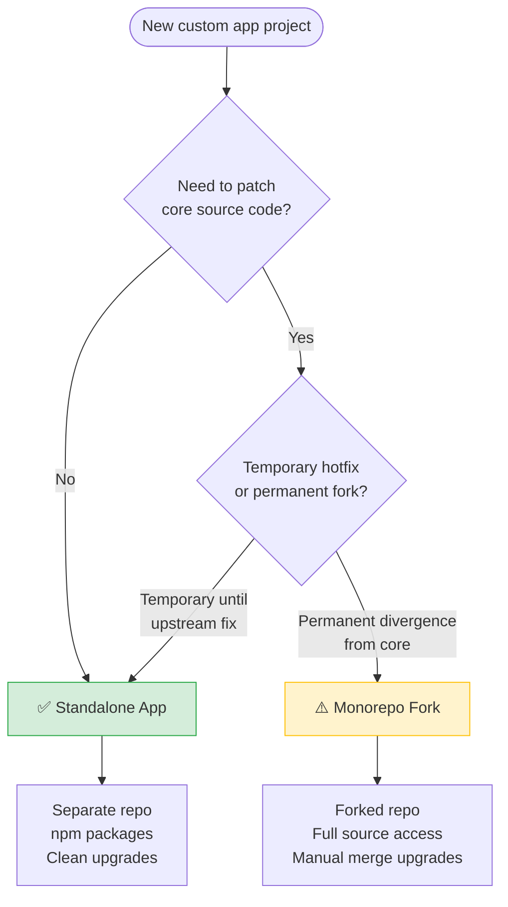
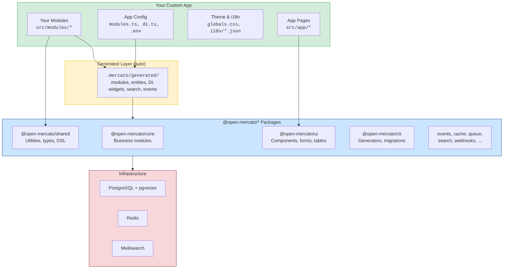
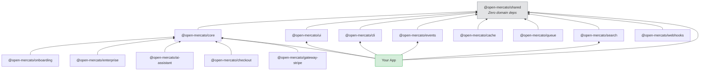
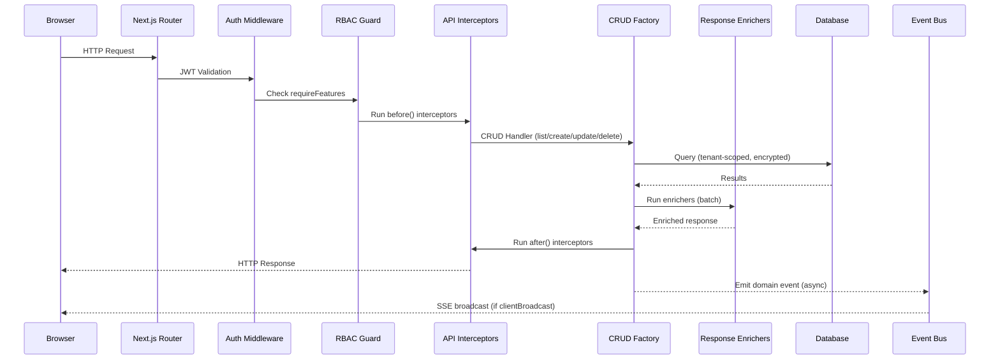
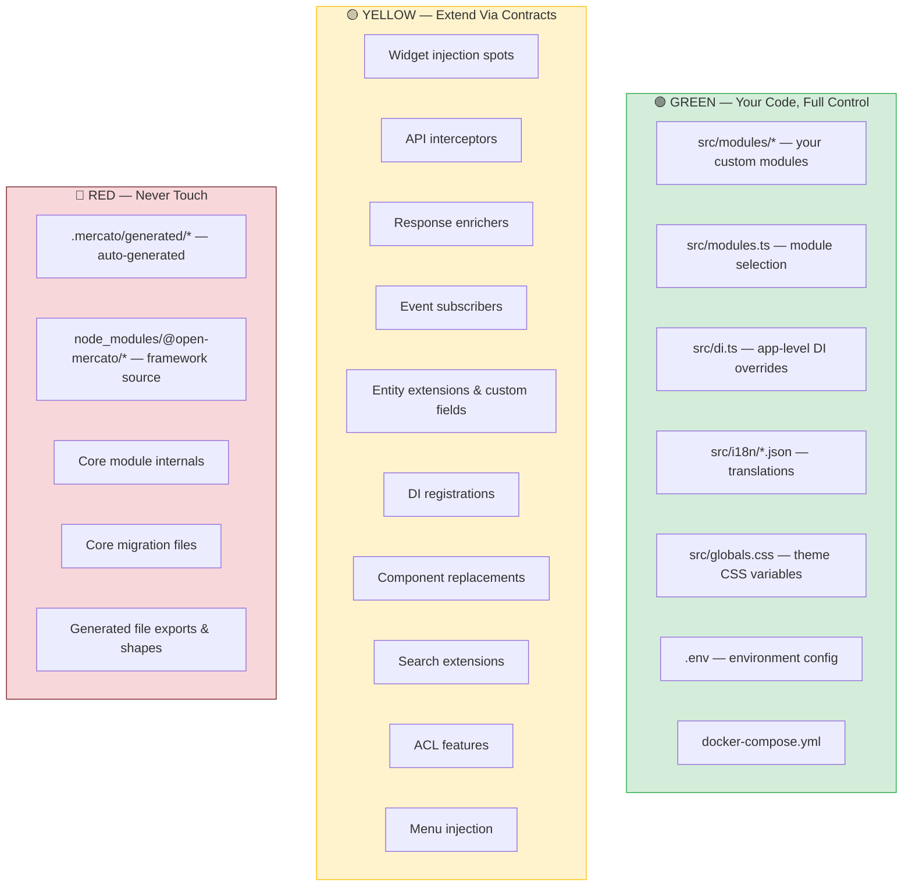
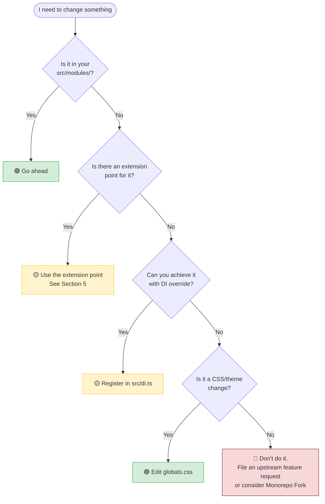
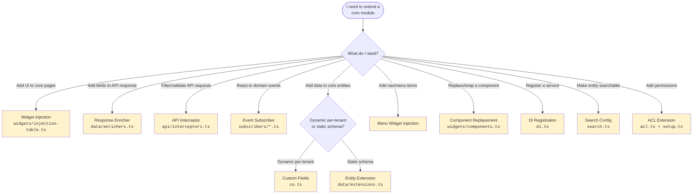
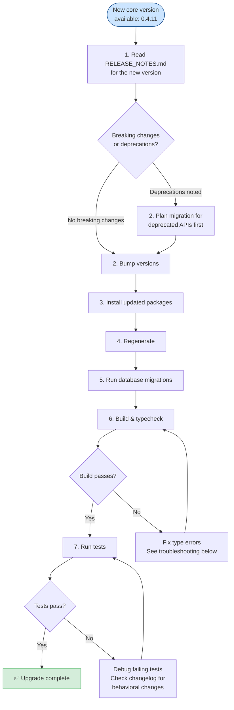
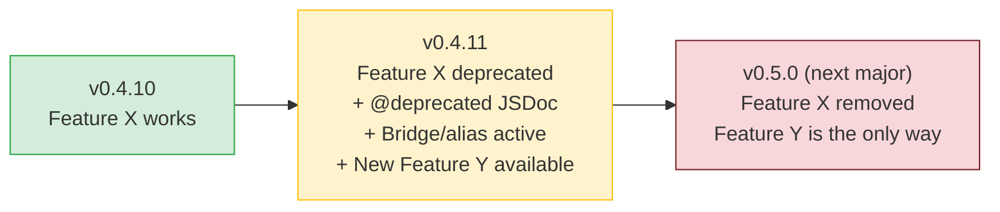

# Building Custom Apps on Open Mercato

A guide for teams building products on top of Open Mercato. Covers project setup, customization patterns, safe extension points, and upgrading core packages without breaking your work.

> **Audience**: Internal teams consuming Open Mercato as a framework — not developing the core itself.

---

## Table of Contents

1. [Decision Framework: Standalone vs Monorepo](#1-decision-framework)
2. [Architecture Overview](#2-architecture-overview)
3. [Spinning Up a New Project](#3-spinning-up-a-new-project)
4. [The Safe Zone — What You Can Touch](#4-the-safe-zone)
5. [Customization Patterns](#5-customization-patterns)
6. [Upgrading Core Packages](#6-upgrading-core-packages)
7. [Quick Reference](#7-quick-reference)

---

## 1. Decision Framework

Before writing any code, choose your project model. This is the most consequential decision — changing later is expensive.

### Decision Flowchart



### Comparison

| Aspect | Standalone App | Monorepo Fork |
|--------|---------------|---------------|
| **Project setup** | `npx create-mercato-app my-app` | `git clone` + fork upstream |
| **Package source** | `node_modules/@open-mercato/*/dist/` (compiled JS) | `packages/*/src/` (TypeScript source) |
| **Your modules live in** | `src/modules/` | `apps/mercato/src/modules/` |
| **Upgrade path** | `yarn add @open-mercato/*@0.4.11` | `git merge upstream/main` + conflict resolution |
| **Can patch core** | No (use extension points instead) | Yes (but you own the merge debt) |
| **Generator reads from** | `dist/modules/*.js` | `src/modules/*.ts` |
| **Best for** | Most projects. Clean separation, easy upgrades | Deep core modifications, experimental features |

### When to Choose What

**Choose Standalone** (90% of projects) when:
- You build features via modules, widgets, interceptors, and other extension points
- You want painless version upgrades
- Your team doesn't need to modify core framework internals
- You deploy the app independently from core development

**Choose Monorepo Fork** when:
- You need to patch core modules that can't be addressed via extension points
- You're building experimental features that may be contributed back upstream
- You need full TypeScript source debugging of framework internals

> **Rule of thumb**: If the 10 extension mechanisms (Section 5) can achieve your goal, use Standalone. If you find yourself needing to edit files inside `packages/core/src/modules/`, you need a Monorepo Fork.

---

## 2. Architecture Overview

### Your App in the Stack



### Package Dependency Graph



### The Module System

Open Mercato's architecture is built on **convention-based auto-discovery**. You don't register routes or wire up handlers manually — you place files in the right locations and the framework finds them.

```mermaid
flowchart LR
    subgraph MODULE["Your Module: <code>src/modules/my_crm/</code>"]
        direction TB
        IDX["index.ts<br/><em>metadata</em>"]
        ACL["acl.ts<br/><em>permissions</em>"]
        SETUP["setup.ts<br/><em>seeding</em>"]
        EVENTS["events.ts<br/><em>domain events</em>"]
        DI["di.ts<br/><em>services</em>"]
        CE["ce.ts<br/><em>custom fields</em>"]
        API["api/*/route.ts<br/><em>REST endpoints</em>"]
        BACK["backend/*/page.tsx<br/><em>admin pages</em>"]
        FRONT["frontend/*.tsx<br/><em>public pages</em>"]
        SUBS["subscribers/*.ts<br/><em>event handlers</em>"]
        WORK["workers/*.ts<br/><em>background jobs</em>"]
        DATA["data/entities.ts<br/><em>ORM entities</em>"]
        VALID["data/validators.ts<br/><em>Zod schemas</em>"]
        WIDG["widgets/injection/<br/><em>UI extensions</em>"]
    end

    MODULE -->|yarn generate| GEN[".mercato/generated/*"]
    GEN -->|bootstrap| APP["Running App"]
```



**Key concept**: Your custom modules follow the **exact same conventions** as core modules. There's no second-class citizen pattern — your `src/modules/my_crm/` has the same capabilities as `@open-mercato/core/modules/customers/`.

### Request Lifecycle



---

## 3. Spinning Up a New Project

### Path A: Standalone App (Recommended)

```bash
# 1. Scaffold
npx create-mercato-app my-app
cd my-app

# 2. Setup (handles .env, install, generate, migrate, initialize)
yarn setup

# 3. Start developing
yarn dev
```

**What `yarn setup` does under the hood:**
1. Copies `.env.example` → `.env` (edit with your DB credentials)
2. Installs dependencies
3. Runs `yarn generate` (scans modules, creates `.mercato/generated/`)
4. Runs `yarn db:migrate` (applies all migrations)
5. Runs `yarn initialize` (creates tenant, seeds data)

**Prerequisites:**
- Node.js 24+
- PostgreSQL (with pgvector extension)
- Redis (optional, for queues/cache)
- Meilisearch (optional, for fulltext search)

**Quick infrastructure via Docker Compose:**
```bash
docker compose up -d   # Starts PostgreSQL, Redis, Meilisearch
```

### Path B: Monorepo Fork

```bash
# 1. Fork and clone
git clone https://github.com/your-org/open-mercato-fork.git my-project
cd my-project
git remote add upstream https://github.com/open-mercato/open-mercato.git

# 2. Install and build
yarn install
yarn build:packages
yarn generate
yarn build:packages      # Second build after generate

# 3. Initialize
yarn initialize

# 4. Start developing
yarn dev
```

### Project Structure (Standalone)

```
my-app/
├── src/
│   ├── modules/                  # ← YOUR CODE GOES HERE
│   │   ├── my_crm/              #   Custom module
│   │   │   ├── index.ts
│   │   │   ├── acl.ts
│   │   │   ├── setup.ts
│   │   │   ├── events.ts
│   │   │   ├── di.ts
│   │   │   ├── data/
│   │   │   │   ├── entities.ts
│   │   │   │   └── validators.ts
│   │   │   ├── api/
│   │   │   │   └── leads/route.ts
│   │   │   ├── backend/
│   │   │   │   └── leads/page.tsx
│   │   │   ├── subscribers/
│   │   │   ├── workers/
│   │   │   └── widgets/
│   │   └── example/              #   Included reference module
│   ├── modules.ts                # ← Enable/disable modules
│   ├── di.ts                     # ← App-level DI overrides
│   ├── bootstrap.ts              #   App initialization
│   ├── app/                      #   Next.js app router
│   │   ├── layout.tsx
│   │   ├── (backend)/backend/    #   Admin panel routes
│   │   └── api/                  #   API catch-all router
│   ├── i18n/                     # ← Your translations
│   │   ├── en.json
│   │   ├── de.json
│   │   ├── es.json
│   │   └── pl.json
│   └── globals.css               # ← Theme customization
├── .mercato/
│   └── generated/                # ⚠️ AUTO-GENERATED — never edit
├── node_modules/
│   └── @open-mercato/            # 📦 Framework packages (compiled JS)
├── docker-compose.yml
├── .env
└── package.json
```

### Registering Modules

Edit `src/modules.ts` to control which modules are active:

```typescript
import type { ModuleEntry } from '@open-mercato/shared/modules/registry'

export const enabledModules: ModuleEntry[] = [
  // Core modules (from npm packages)
  { id: 'auth', from: '@open-mercato/core' },
  { id: 'customers', from: '@open-mercato/core' },
  { id: 'catalog', from: '@open-mercato/core' },
  { id: 'sales', from: '@open-mercato/core' },
  { id: 'dashboard', from: '@open-mercato/core' },
  { id: 'dictionaries', from: '@open-mercato/core' },
  // ... enable what you need, disable what you don't

  // Your custom modules
  { id: 'my_crm', from: '@app' },

  // Example module (remove when not needed)
  // { id: 'example', from: '@app' },
]
```

After changing `modules.ts`, always run:
```bash
yarn generate    # Regenerate auto-discovery files
```

---

## 4. The Safe Zone

This is the most important section for avoiding upgrade headaches. Every file and pattern falls into one of three zones.

### Zone Map



### Green Zone: Full Control

These files are yours. Core upgrades never overwrite them.

| File | Purpose |
|------|---------|
| `src/modules/*` | All your custom module code |
| `src/modules.ts` | Which modules are enabled |
| `src/di.ts` | App-level DI overrides (runs after all module registrars) |
| `src/i18n/*.json` | Your translation strings (4 locales: en, de, es, pl) |
| `src/globals.css` | CSS variables for theming (colors, fonts, radii) |
| `.env` | Database URLs, API keys, feature flags |
| `docker-compose.yml` | Infrastructure services |

### Yellow Zone: Extend Via Contracts

These are the framework's **official extension points**. They are governed by the [Backward Compatibility Contract](BACKWARD_COMPATIBILITY.md) — Open Mercato guarantees their stability across minor versions.

The 13 contract surfaces that protect your customizations:

| # | Contract Surface | Stability | What It Means For You |
|---|-----------------|-----------|----------------------|
| 1 | Auto-discovery file conventions | **FROZEN** | File names like `acl.ts`, `events.ts`, `api/*/route.ts` will never change |
| 2 | Type definitions & interfaces | **STABLE** | Required fields won't be removed; new optional fields may be added |
| 3 | Function signatures | **STABLE** | Params won't be removed/reordered; new optional params may appear |
| 4 | Import paths | **STABLE** | `@open-mercato/ui/backend/CrudForm` will always work (redirected if moved) |
| 5 | Event IDs | **FROZEN** | `customers.person.created` will never be renamed |
| 6 | Widget injection spot IDs | **FROZEN** | `crud-form:customers.person:fields` will never be renamed |
| 7 | API route URLs | **STABLE** | `/api/customers/people` won't change; response fields are additive-only |
| 8 | Database schema | **ADDITIVE-ONLY** | Core will add columns (with defaults), never remove or rename |
| 9 | DI service names | **STABLE** | `queryEngine`, `eventBus`, `cacheService` keys won't change |
| 10 | ACL feature IDs | **FROZEN** | `customers.view` will never be renamed (stored in DB) |
| 11 | Notification type IDs | **FROZEN** | Referenced by subscribers and persisted |
| 12 | CLI commands | **STABLE** | `yarn generate`, `yarn db:migrate` won't change |
| 13 | Generated file contracts | **STABLE** | Export shapes from `.mercato/generated/` are stable |

**What FROZEN means**: Will never change. Period. Safe to hard-code references.

**What STABLE means**: Won't break in minor versions. Deprecation protocol applies (deprecated → bridged for ≥1 minor version → removed in next major).

**What ADDITIVE-ONLY means**: New things may appear, existing things won't change.

### Red Zone: Never Touch

| What | Why |
|------|-----|
| `.mercato/generated/*` | Regenerated on every `yarn generate` — your edits will be lost |
| `node_modules/@open-mercato/*` | Overwritten on every `yarn install` |
| Core module source files | In standalone: you can't. In monorepo: creates merge hell |
| Core migration files | Core owns its schema — use entity extensions and custom fields instead |

### Decision: "Can I Do This Safely?"



---

## 5. Customization Patterns

### 5.1 Adding a Custom Module

Every custom module follows the same conventions as core modules. Here's a complete example — a "Leads" module for a CRM app.

#### Step 1: Create Module Structure

```
src/modules/leads/
├── index.ts              # Module metadata
├── acl.ts                # Permissions
├── setup.ts              # Seeding & role defaults
├── events.ts             # Domain events
├── data/
│   ├── entities.ts       # Database entities
│   └── validators.ts     # Zod schemas
├── api/
│   └── leads/route.ts    # CRUD API
├── backend/
│   ├── page.tsx          # List page
│   └── [id]/page.tsx     # Detail/edit page
└── widgets/
    └── injection-table.ts
```

#### Step 2: Module Metadata (`index.ts`)

```typescript
import type { ModuleInfo } from '@open-mercato/shared/modules/registry'

export const metadata: ModuleInfo = {
  id: 'leads',
  name: 'Leads',
  description: 'Lead management for sales pipeline',
  version: '1.0.0',
}
```

#### Step 3: Database Entities (`data/entities.ts`)

```typescript
import { Entity, PrimaryKey, Property, OptionalProps } from '@mikro-orm/core'

@Entity({ tableName: 'leads' })
export class Lead {
  [OptionalProps]?: 'createdAt' | 'updatedAt' | 'deletedAt' | 'isActive'

  @PrimaryKey({ type: 'uuid', defaultRaw: 'gen_random_uuid()' })
  id!: string

  @Property({ name: 'organization_id', type: 'uuid' })
  organizationId!: string

  @Property({ name: 'tenant_id', type: 'uuid' })
  tenantId!: string

  @Property({ type: 'text' })
  name!: string

  @Property({ type: 'text', nullable: true })
  email?: string | null

  @Property({ type: 'text', nullable: true })
  phone?: string | null

  @Property({ type: 'text', default: 'new' })
  status: string = 'new'

  @Property({ name: 'is_active', type: 'boolean', default: true })
  isActive: boolean = true

  @Property({ name: 'created_at', type: Date, onCreate: () => new Date() })
  createdAt: Date = new Date()

  @Property({ name: 'updated_at', type: Date, onUpdate: () => new Date() })
  updatedAt: Date = new Date()

  @Property({ name: 'deleted_at', type: Date, nullable: true })
  deletedAt?: Date | null
}
```

**Mandatory columns**: Every entity MUST have `id`, `organization_id`, `tenant_id`, `created_at`, `updated_at`, `deleted_at`.

#### Step 4: Validators (`data/validators.ts`)

```typescript
import { z } from 'zod'

export const leadCreateSchema = z.object({
  organizationId: z.string().uuid(),
  tenantId: z.string().uuid(),
  name: z.string().trim().min(1).max(200),
  email: z.string().trim().email().max(320).optional(),
  phone: z.string().trim().max(50).optional(),
  status: z.enum(['new', 'contacted', 'qualified', 'lost', 'won']).default('new'),
})

export const leadUpdateSchema = leadCreateSchema.partial().required({ organizationId: true, tenantId: true })

export type LeadCreateInput = z.infer<typeof leadCreateSchema>
export type LeadUpdateInput = z.infer<typeof leadUpdateSchema>
```

#### Step 5: Permissions (`acl.ts`)

```typescript
export const features = [
  { id: 'leads.view', title: 'View leads', module: 'leads' },
  { id: 'leads.create', title: 'Create leads', module: 'leads' },
  { id: 'leads.update', title: 'Update leads', module: 'leads' },
  { id: 'leads.delete', title: 'Delete leads', module: 'leads' },
]
```

#### Step 6: Setup & Seeding (`setup.ts`)

```typescript
import type { ModuleSetupConfig } from '@open-mercato/shared/modules/setup'

export const setup: ModuleSetupConfig = {
  defaultRoleFeatures: {
    superadmin: ['leads.*'],
    admin: ['leads.*'],
    employee: ['leads.view', 'leads.create', 'leads.update'],
  },

  async seedDefaults({ em, tenantId, organizationId }) {
    // Seed default lead statuses, pipeline stages, etc.
  },

  async seedExamples({ em, tenantId, organizationId }) {
    // Create demo leads for development
  },
}
```

#### Step 7: Register & Generate

```typescript
// src/modules.ts — add your module
{ id: 'leads', from: '@app' },
```

```bash
yarn generate          # Auto-discover new module
yarn db:generate       # Generate migration for new entity
yarn db:migrate        # Apply migration
```

### 5.2 Extending Core Modules

This is where the Yellow Zone extension points come in. Each mechanism solves a different problem.

#### Extension Point Decision Tree



---

#### 5.2.1 Widget Injection — Add UI to Core Pages

Inject columns, fields, tabs, actions, or full components into core module pages.

**Common spot IDs:**

| Spot Pattern | Injects Into |
|-------------|-------------|
| `crud-form:<entityId>:fields` | Form fields on create/edit pages |
| `data-table:<tableId>:columns` | Table columns on list pages |
| `data-table:<tableId>:row-actions` | Row context menu actions |
| `data-table:<tableId>:bulk-actions` | Bulk action buttons |
| `data-table:<tableId>:filters` | Filter controls |
| `menu:sidebar:main` | Main sidebar navigation |
| `menu:sidebar:settings` | Settings sidebar |
| `menu:topbar:profile-dropdown` | User profile dropdown |
| `<module>.detail:details` | Detail page tabs/sections |

**Example: Add a "Priority" column to the Customers table**

```typescript
// src/modules/leads/widgets/injection/customer-priority-column/widget.ts
import type { InjectionColumnWidget } from '@open-mercato/shared/modules/widgets/injection'

const widget: InjectionColumnWidget = {
  metadata: {
    id: 'leads.injection.customer-priority-column',
    priority: 40,
  },
  columns: [
    {
      id: 'lead_score',
      header: 'leads.columns.score',  // i18n key
      accessorKey: '_leads.score',     // From response enricher
      sortable: false,
    },
  ],
}
export default widget
```

```typescript
// src/modules/leads/widgets/injection-table.ts
import type { ModuleInjectionTable } from '@open-mercato/shared/modules/widgets/injection'
import { InjectionPosition } from '@open-mercato/shared/modules/widgets/injection-position'

export const injectionTable: ModuleInjectionTable = {
  'data-table:customers.people:columns': {
    widgetId: 'leads.injection.customer-priority-column',
    priority: 30,
  },
  'menu:sidebar:main': {
    widgetId: 'leads.injection.sidebar-menu',
    priority: 50,
    placement: { position: InjectionPosition.After, relativeTo: 'customers' },
  },
}
```

**Example: Add a field to the Customer create/edit form**

```typescript
// src/modules/leads/widgets/injection/customer-source-field/widget.ts
import type { InjectionFieldWidget } from '@open-mercato/shared/modules/widgets/injection'

const widget: InjectionFieldWidget = {
  metadata: {
    id: 'leads.injection.customer-source-field',
    priority: 40,
  },
  fields: [
    {
      id: 'lead_source',
      label: 'leads.fields.source',
      type: 'select',
      options: [
        { value: 'website', label: 'Website' },
        { value: 'referral', label: 'Referral' },
        { value: 'cold_call', label: 'Cold Call' },
        { value: 'trade_show', label: 'Trade Show' },
      ],
    },
  ],
}
export default widget
```

---

#### 5.2.2 Response Enrichers — Add Fields to API Responses

Add computed fields to another module's CRUD responses without modifying the core entity.

```typescript
// src/modules/leads/data/enrichers.ts
import type { ResponseEnricher } from '@open-mercato/shared/lib/crud/response-enricher'

const leadScoreEnricher: ResponseEnricher = {
  id: 'leads.customer-lead-score',
  targetEntity: 'customers.person',         // Enrich customer API responses
  features: ['leads.view'],                 // Only for users with leads.view
  priority: 10,
  timeout: 2000,
  critical: false,
  fallback: { _leads: { score: null } },

  async enrichOne(record, context) {
    return (await this.enrichMany!([record], context))[0]
  },

  async enrichMany(records, context) {
    if (records.length === 0) return records

    const em = context.em.fork()
    const scores = await em.find('LeadScore', {
      customerId: { $in: records.map(r => r.id) },
      tenantId: context.tenantId,
    })

    const scoreMap = new Map(scores.map(s => [s.customerId, s.score]))

    return records.map(record => ({
      ...record,
      _leads: {                             // Namespaced under _moduleName
        score: scoreMap.get(record.id) ?? null,
      },
    }))
  },
}

export const enrichers: ResponseEnricher[] = [leadScoreEnricher]
```

**Rules:**
- Always namespace enrichment data under `_<moduleName>` (e.g., `_leads`)
- Always implement `enrichMany()` to avoid N+1 queries on list pages
- Set `critical: false` unless the page is unusable without this data

---

#### 5.2.3 API Interceptors — Filter/Validate/Transform Requests

Hook into any CRUD route's request/response cycle.

```typescript
// src/modules/leads/api/interceptors.ts
import type { ApiInterceptor } from '@open-mercato/shared/lib/crud/api-interceptor'

export const interceptors: ApiInterceptor[] = [
  {
    id: 'leads.filter-customers-by-source',
    targetRoute: 'customers/people',       // Intercept customer list API
    methods: ['GET'],
    priority: 70,

    async before(request, context) {
      const source = request.query?.leadSource as string | undefined
      if (!source) return { ok: true }

      // Find customers matching the lead source
      const matches = await context.em.find('LeadSource', {
        source,
        organizationId: context.organizationId,
      }, { fields: ['customerId'] })

      const ids = matches.map(m => m.customerId).join(',')
      return {
        ok: true,
        query: {
          ...request.query,
          leadSource: undefined,           // Remove custom param
          ids: ids || undefined,           // Rewrite to standard ID filter
        },
      }
    },
  },
]
```

---

#### 5.2.4 Event Subscribers — React to Domain Events

Subscribe to events emitted by core modules.

```typescript
// src/modules/leads/subscribers/customer-created-score.ts
export const metadata = {
  event: 'customers.person.created',       // Core event ID (FROZEN)
  persistent: true,                        // Survives restart, retried on failure
  id: 'leads:score-new-customer',
}

export default async function handler(payload, ctx) {
  const em = ctx.resolve('em')
  // Calculate initial lead score for new customer
  const score = calculateInitialScore(payload)
  em.create('LeadScore', {
    customerId: payload.id,
    score,
    organizationId: payload.organizationId,
    tenantId: payload.tenantId,
  })
  await em.flush()
}
```

**Subscriber types:**
- `persistent: true` — Queued, retried on failure. Use for side effects that must succeed (notifications, indexing, audit).
- `persistent: false` (or omitted) — In-memory, fire-and-forget. Use for cache invalidation, real-time UI updates.

---

#### 5.2.5 Custom Fields — Dynamic Per-Tenant Data

Let users add fields to any entity without code changes.

```typescript
// src/modules/leads/ce.ts
import type { CustomEntitySpec } from '@open-mercato/shared/modules/entities'

export const entities: CustomEntitySpec[] = [
  {
    id: 'leads:lead',                      // Your own entity
    label: 'Lead',
    fields: [
      { key: 'temperature', kind: 'select', label: 'Temperature',
        options: ['cold', 'warm', 'hot'], filterable: true, formEditable: true },
      { key: 'budget_range', kind: 'float', label: 'Budget Range',
        filterable: true, formEditable: true },
    ],
  },
  {
    id: 'customers:person',                // Extend CORE entity
    label: 'Person',
    fields: [
      { key: 'lead_source', kind: 'select', label: 'Lead Source',
        options: ['website', 'referral', 'cold_call'], formEditable: true },
    ],
  },
]
```

Custom fields are stored in `custom_entities_storage` (JSONB) — no migration needed.

---

#### 5.2.6 Entity Extensions — Static Cross-Module Links

When you need a real database relationship between your module and a core entity.

```typescript
// src/modules/leads/data/extensions.ts
import type { EntityExtension } from '@open-mercato/shared/modules/entities'

export const extensions: EntityExtension[] = [
  {
    id: 'leads.customer-lead-link',
    base: 'customers:person',              // Core entity you're extending
    extension: 'leads:lead_assignment',    // Your extension entity
    cardinality: 'one-to-many',
    join: {
      fromField: 'id',
      toField: 'customer_id',
    },
  },
]
```

**Rule**: Never add columns to core tables. Create a separate extension entity in your module.

---

#### 5.2.7 Component Replacement — Swap/Wrap Core UI

Replace or wrap any core component that exposes a handle ID.

```typescript
// src/modules/leads/widgets/components.ts
import type { ComponentOverride } from '@open-mercato/shared/modules/widgets/components'

export const componentOverrides: ComponentOverride[] = [
  {
    handle: 'section:customers:person:header',
    mode: 'wrapper',
    // Wrap the core header with your custom scoring badge
    component: (props) => {
      const OriginalHeader = props.children
      return (
        <div>
          {OriginalHeader}
          <LeadScoreBadge customerId={props.entityId} />
        </div>
      )
    },
  },
]
```

Override modes (highest to lowest priority):
1. **`replacement`** — Completely replace the component
2. **`wrapper`** — Wrap around the original (HOC pattern)
3. **`propsTransform`** — Modify props before they reach the original

---

#### 5.2.8 DI Registration — Custom Services

Register your own services or override framework services.

```typescript
// src/modules/leads/di.ts
import type { AppContainer } from '@open-mercato/shared/lib/di/container'
import { asFunction } from 'awilix'
import { LeadScoringService } from './lib/scoring-service'

export function register(container: AppContainer) {
  container.register({
    leadScoringService: asFunction(() => new LeadScoringService()).singleton(),
  })
}
```

For app-level overrides (runs after all module registrars):

```typescript
// src/di.ts
export function register(container: AppContainer) {
  // Override a core service
  container.register({
    emailService: asFunction(() => new MyCustomEmailService()).singleton(),
  })
}
```

---

### 5.3 Theming

Customize the look and feel by editing CSS variables in `src/globals.css`.

```css
/* src/globals.css — override theme colors */
:root {
  --primary: 0.6 0.2 250;           /* OKLch: lightness, chroma, hue */
  --primary-foreground: 0.98 0 0;
  --sidebar: 0.15 0.02 250;
  --sidebar-foreground: 0.95 0 0;
  --radius: 0.5rem;                  /* Border radius base */
}

.dark {
  --primary: 0.7 0.25 250;
  --background: 0.13 0.02 250;
}
```

The framework uses **OKLch color space** for perceptually uniform colors. All UI components read from these CSS variables via Tailwind.

### 5.4 Internationalization

Add or modify translations in `src/i18n/<locale>.json`:

```json
{
  "leads.menu.title": "Leads",
  "leads.columns.score": "Lead Score",
  "leads.fields.source": "Lead Source",
  "leads.status.new": "New",
  "leads.status.contacted": "Contacted"
}
```

**Rules:**
- All 4 locale files (en, de, es, pl) must stay in sync
- Keys must be alphabetically sorted (CI enforces this)
- Use `useT()` client-side, `resolveTranslations()` server-side
- Run `yarn tsx scripts/i18n-check-sync.ts --fix` to auto-sort

---

## 6. Upgrading Core Packages

### Upgrade Flowchart



### Step-by-Step: Standalone App Upgrade

```bash
# 1. Read the changelog first
#    Check RELEASE_NOTES.md in the Open Mercato repo for the target version

# 2. Bump all @open-mercato packages to the new version
yarn add \
  @open-mercato/shared@0.4.11 \
  @open-mercato/core@0.4.11 \
  @open-mercato/ui@0.4.11 \
  @open-mercato/cli@0.4.11 \
  @open-mercato/events@0.4.11 \
  @open-mercato/cache@0.4.11 \
  @open-mercato/queue@0.4.11 \
  @open-mercato/search@0.4.11

# 3. Regenerate (new version may have new/changed module discovery)
yarn generate

# 4. Apply any new database migrations from core
yarn db:migrate

# 5. Build and check types
yarn build
yarn typecheck

# 6. Run your tests
yarn test
yarn test:integration
```

### Step-by-Step: Monorepo Fork Upgrade

```bash
# 1. Fetch upstream changes
git fetch upstream

# 2. Merge into your branch (or rebase if you prefer)
git merge upstream/main

# 3. Resolve conflicts (focus on modules.ts, package.json, generated files)

# 4. Rebuild everything
yarn install
yarn build:packages
yarn generate
yarn build:packages

# 5. Apply migrations
yarn db:migrate

# 6. Type check and test
yarn typecheck
yarn test
yarn build:app
```

### What Can Break During Upgrades

| Symptom | Likely Cause | Fix |
|---------|-------------|-----|
| Type errors in your modules | Core added required fields to an interface | Add the new required fields to your code |
| Type errors on `.extend()` | Zod schema type changed | Check if schema base type changed; update accordingly |
| Missing import | Import path moved | Check RELEASE_NOTES for new path; old path should still re-export |
| Migration failure | Column conflict with your entity extension | Check if core added a column you already created; rename yours |
| Widget not rendering | Injection spot ID changed | Unlikely (FROZEN), but check if spot was deprecated |
| API response shape changed | New fields added (additive) | Should not break; update types if you have strict response parsing |
| Event subscriber not firing | Event ID changed | Unlikely (FROZEN); check if event was deprecated |
| Build failure in generated files | New generator output format | Delete `.mercato/generated/`, run `yarn generate` fresh |

### The Deprecation Safety Net

Core follows a strict deprecation protocol:



**You always get at least one minor version** to migrate away from deprecated APIs. TypeScript will show `@deprecated` warnings, and RELEASE_NOTES will document the migration path.

### Recommended Upgrade Cadence

- **Patch versions** (0.4.10 → 0.4.11): Upgrade promptly. Bug fixes and small additions.
- **Minor versions** (0.4.x → 0.5.0): Schedule a dedicated upgrade session. Read changelog carefully. May contain deprecation removals.
- **Major versions** (0.x → 1.0): Plan a sprint. Expect migration work.

### Pre-Upgrade Checklist

- [ ] Read RELEASE_NOTES.md for every version between current and target
- [ ] Check for `@deprecated` warnings in your IDE (may become errors after upgrade)
- [ ] Ensure your test suite is green BEFORE upgrading
- [ ] Create a git branch for the upgrade (`git checkout -b upgrade/0.4.11`)
- [ ] After upgrade: `yarn generate` → `yarn db:migrate` → `yarn build` → `yarn typecheck` → `yarn test`
- [ ] Verify key user flows manually
- [ ] Merge upgrade branch

---

## 7. Quick Reference

### Key Commands

```bash
# Development
yarn dev                          # Start dev server
yarn generate                     # Regenerate auto-discovery files
yarn db:generate                  # Generate migration from entity changes
yarn db:migrate                   # Apply pending migrations
yarn db:greenfield                # Reset database completely

# Quality
yarn build                        # Build everything
yarn build:packages               # Build packages only
yarn typecheck                    # TypeScript strict check
yarn lint                         # Lint all code
yarn test                         # Unit tests
yarn test:integration             # Playwright integration tests

# Project setup
yarn setup                        # Full initial setup (standalone)
yarn initialize                   # Create tenant & seed data
yarn reinstall                    # Reset and reinitialize
```

### Import Paths (Most Common)

```typescript
// UI Components
import { CrudForm } from '@open-mercato/ui/backend/CrudForm'
import { DataTable } from '@open-mercato/ui/backend/DataTable'
import { FormHeader, FormFooter } from '@open-mercato/ui/backend/forms'
import { LoadingMessage, ErrorMessage } from '@open-mercato/ui/backend/detail'
import { Button } from '@open-mercato/ui/primitives/button'
import { IconButton } from '@open-mercato/ui/primitives/icon-button'
import { flash } from '@open-mercato/ui/backend/FlashMessages'
import { useConfirmDialog } from '@open-mercato/ui/backend/confirm-dialog'

// API
import { apiCall, apiCallOrThrow } from '@open-mercato/ui/backend/utils/apiCall'

// i18n
import { useT } from '@open-mercato/shared/lib/i18n/context'
import { resolveTranslations } from '@open-mercato/shared/lib/i18n/server'

// Data & Types
import type { DataEngine } from '@open-mercato/shared/lib/data/engine'
import type { ModuleInfo } from '@open-mercato/shared/modules/registry'
import type { ModuleSetupConfig } from '@open-mercato/shared/modules/setup'
import type { ApiInterceptor } from '@open-mercato/shared/lib/crud/api-interceptor'
import type { ResponseEnricher } from '@open-mercato/shared/lib/crud/response-enricher'

// Injection & Extension
import { InjectionPosition } from '@open-mercato/shared/modules/widgets/injection-position'
import { useInjectedMenuItems } from '@open-mercato/ui/backend/injection/useInjectedMenuItems'
import { useRegisteredComponent } from '@open-mercato/ui/backend/injection/useRegisteredComponent'
import { useAppEvent } from '@open-mercato/ui/backend/injection/useAppEvent'
import { useGuardedMutation } from '@open-mercato/ui/backend/injection/useGuardedMutation'

// Events
import { createModuleEvents } from '@open-mercato/shared/modules/events'

// Custom Fields
import { collectCustomFieldValues } from '@open-mercato/ui/backend/utils/customFieldValues'

// Theming
import { ThemeProvider, useTheme } from '@open-mercato/ui/theme'
```

### Module Convention Files

| File | Export | Purpose | Required? |
|------|--------|---------|-----------|
| `index.ts` | `metadata` | Module name, version, description | Recommended |
| `acl.ts` | `features` | Permission declarations | If you have gated features |
| `setup.ts` | `setup` | Seeding, role defaults | If you need tenant init |
| `events.ts` | `eventsConfig` | Domain event declarations | If you emit events |
| `di.ts` | `register()` | Service registrations | If you register DI services |
| `ce.ts` | `entities` | Custom field definitions | If you use custom fields |
| `search.ts` | `searchConfig` | Search indexing config | If your entities are searchable |
| `notifications.ts` | `notificationTypes` | Notification definitions | If you send notifications |
| `translations.ts` | `translatableFields` | Translatable field declarations | If entities have i18n fields |
| `data/entities.ts` | Entity classes | MikroORM entities | If you have database tables |
| `data/validators.ts` | Zod schemas | Input validation | If you have API routes |
| `data/extensions.ts` | `extensions` | Cross-module entity links | If extending core entities |
| `data/enrichers.ts` | `enrichers` | Response enrichment | If adding fields to core APIs |
| `api/interceptors.ts` | `interceptors` | Request/response hooks | If intercepting core APIs |
| `widgets/injection-table.ts` | `injectionTable` | Widget-to-spot mappings | If injecting UI |
| `widgets/components.ts` | `componentOverrides` | Component replacements | If replacing core components |

### Naming Conventions

| What | Convention | Example |
|------|-----------|---------|
| Module folder | plural, snake_case | `src/modules/leads/` |
| Module ID | plural, snake_case | `leads` |
| Entity class | PascalCase, singular | `Lead` |
| Database table | plural, snake_case | `leads` |
| Database column | snake_case | `organization_id` |
| Event ID | `module.entity.action` (past tense) | `leads.lead.created` |
| Feature ID | `module.action` | `leads.view` |
| Widget ID | `module.injection.name` | `leads.injection.sidebar-menu` |
| Injection spot | `type:entity:slot` | `crud-form:leads.lead:fields` |
| API route file | `api/<resource>/route.ts` | `api/leads/route.ts` |
| Enricher namespace | `_moduleName` prefix | `_leads` |
| i18n key | `module.context.key` | `leads.status.new` |

---

## Appendix: Extension Point Matrix

When you need to extend core, use this matrix to pick the right mechanism:

| I Need To... | Use | Declare In | Runs |
|-------------|-----|-----------|------|
| Add columns to a core table page | Widget injection (column) | `widgets/injection-table.ts` | Client (React) |
| Add fields to a core form | Widget injection (field) | `widgets/injection-table.ts` | Client (React) |
| Add actions to row context menu | Widget injection (row action) | `widgets/injection-table.ts` | Client (React) |
| Add computed fields to API response | Response enricher | `data/enrichers.ts` | Server (per request) |
| Filter/validate core API requests | API interceptor (before) | `api/interceptors.ts` | Server (per request) |
| Transform core API responses | API interceptor (after) | `api/interceptors.ts` | Server (per request) |
| React to core domain events | Event subscriber | `subscribers/*.ts` | Server (async) |
| Add user-defined fields to entities | Custom fields (ce.ts) | `ce.ts` | Stored in JSONB |
| Add DB relationship to core entity | Entity extension | `data/extensions.ts` | Schema (migration) |
| Add sidebar/menu navigation items | Menu widget injection | `widgets/injection-table.ts` | Client (React) |
| Replace/wrap a core UI component | Component override | `widgets/components.ts` | Client (React) |
| Register custom services | DI registration | `di.ts` | Server (startup) |
| Override framework services | App-level DI | `src/di.ts` (root) | Server (startup) |
| Make an entity searchable | Search config | `search.ts` | Server (index time) |
| Add permissions/features | ACL declaration | `acl.ts` + `setup.ts` | Server (auth check) |
